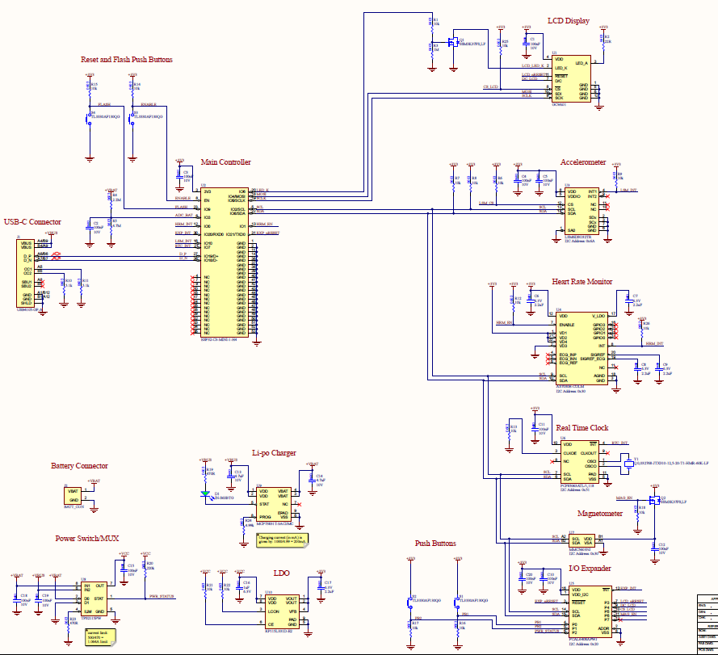
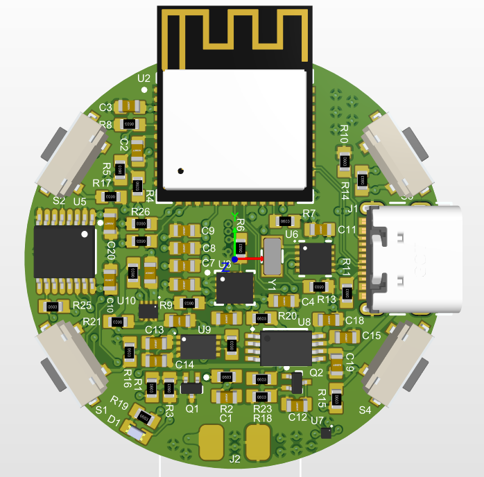
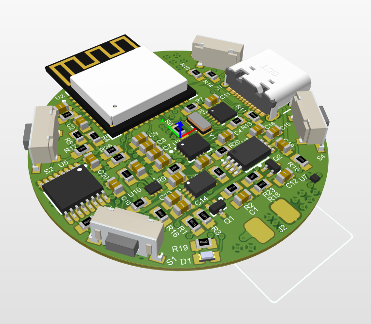
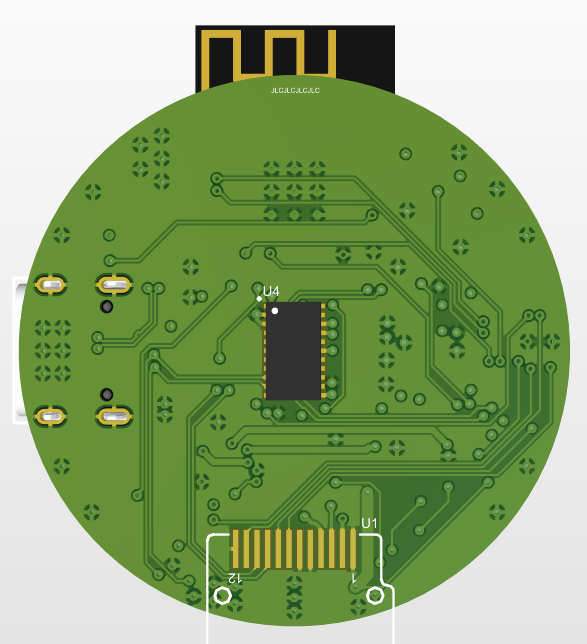
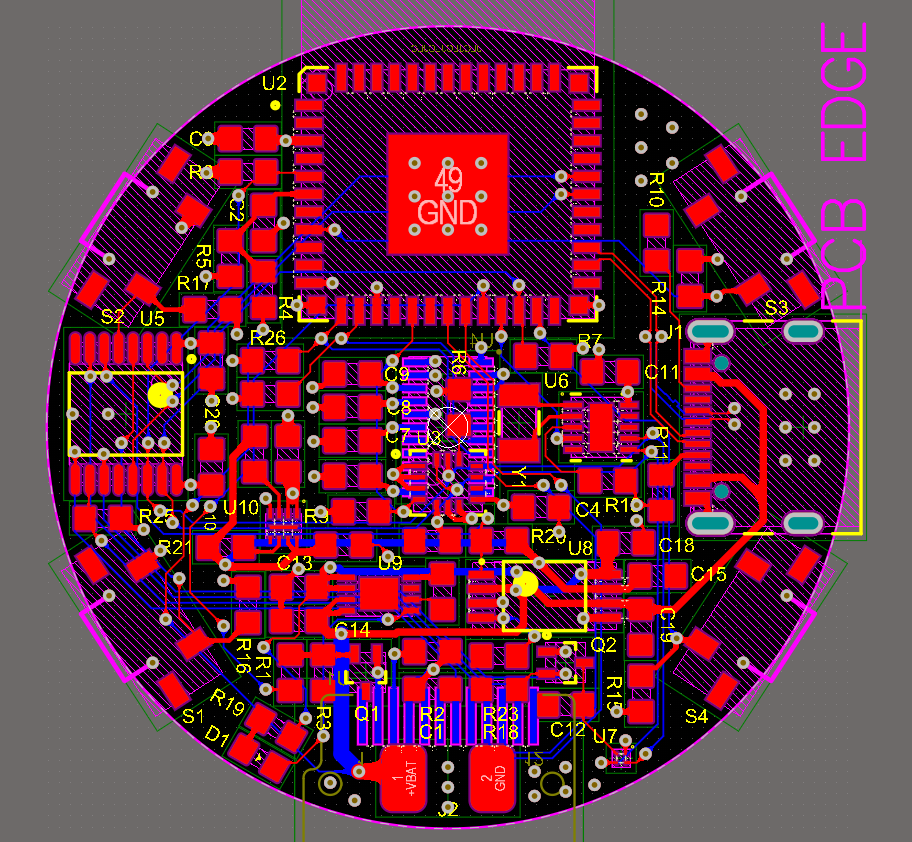
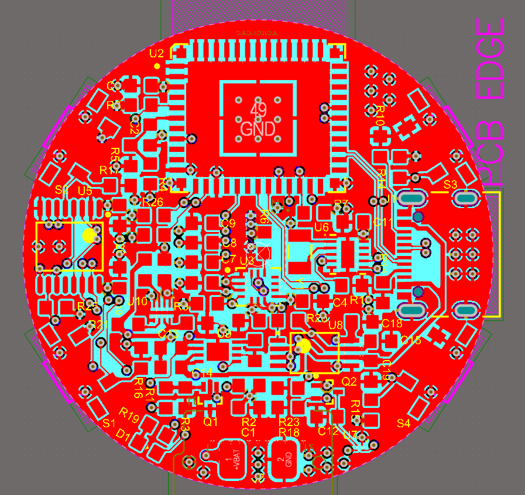

# Smart Watch

This project was made by Jason Skells and Joey Chen.

The schematic and PCB layout was done in Altium Designer and the ESP32 firmware was developed using PlatformIO.

Images of this Smart Watch - an ESP32 based Smart Watch
------------
# Schematic

# Top Side

# Isometric View

# Bottom Side

# Routed Board

# Routed Board with Polygon Pours

